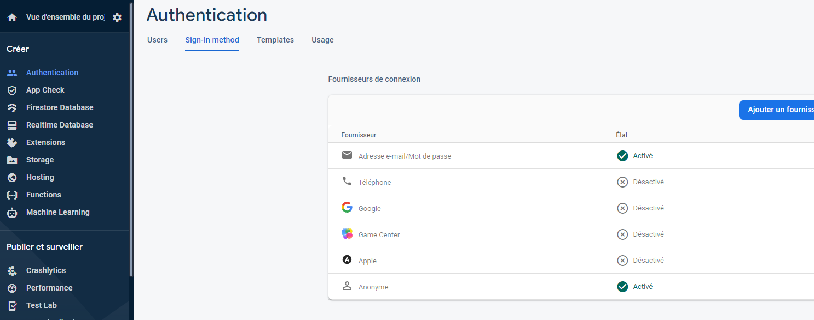
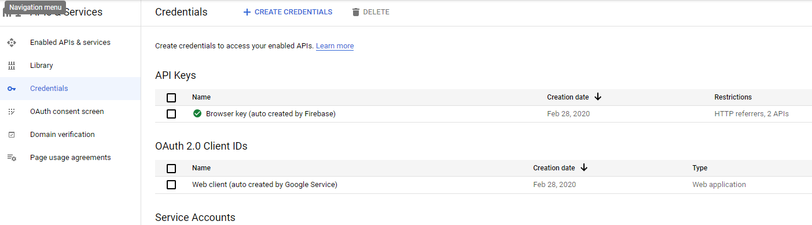
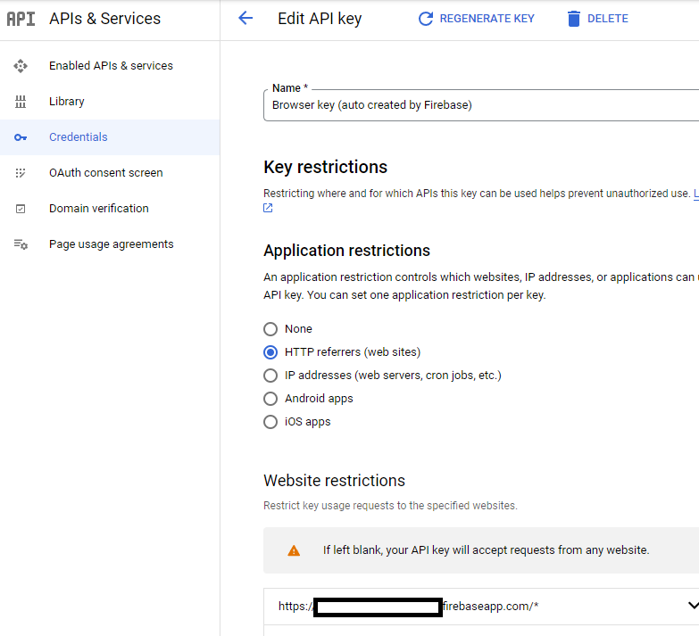
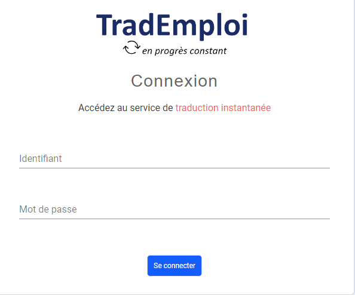

**Trad**: an instantaneous translation application between two people, one of whom is allophone

This project is the backend of the application. The frontend is **trad-frontend** project. Checks readme to install it.
The purpose of this application is describe in the documention of the frontend part.

# Installation main steps

1. Create GCP Infrastructure with Terraform
2. Create Deepl glossaries
3. Configure gitlab CI/CD chain
4. Deploy backend services
5. Create the Firebase application
6. Deploy frontend application
7. Configure security

## Create GCP Infrastructure with Terraform 
**---  This step need to be done only for the project initialization  ---**

[Build Infrastructure - Terraform GCP](translation-app-assessment/terraform/README.md)

## Create Deepl personalized glossaries
**---  This step need to be done only for the project initialization  ---**

[Create Deepl glossaries](translation-app-assessment/deepl-glossary/README.md)

## Configure gitlab CI/CD Chain
**---  This step need to be done only for the project initialization  ---**

Add CI/CD variables in the "Settings > CI/CD Settings > Variables"

- **GCLOUD_SERVICE_KEY_FILE**  =>  Get the json key of the gitlab-sa service account from GCP console in secret manager
- **GCP_PROJECT**  =>  Project ID for each environment
- **TF_VAR_FILE**  =>  Same for all environment
    project_id = gcp_project
    region = "europe-west1"
    schedule: "0 * * * *"
    oidc_audience = "trad.fr"
    app_engine_region_mapping = {
       "europe-west1": "europe-west1",
       "us-central1": "us-central",
    }
- **CB_DEFAULT_VAR_FILE**  =>  CloudBuild default environment variable
    GCP_PROJECT: gcp_project
    LOCATION: europe-west1
- **CB_TRANSLATION_VAR_FILE**  =>  CloudBuild translation CloudRun environment variable, add
    DEEPL_API_KEY: xxxx
    DEEPL_GLOSSARY_XX_XX: xxxx
    ...
- **CB_TOKEN_VAR_FILE**  =>  CloudBuild token-broker CloudRun environment variable
    API_GATEWAY_AUDIENCE: trad.fr

## Deploy backend services
[Build and deploy services](translation-app-assessment/backend/README.md)
(6 services)

## Create the Firebase application
**---  This step need to be done only for the project initialization  ---**

Log in to the Firebase console, https://console.firebase.google.com, then click on "Add project"

Select your existing Google Cloud project from the dropdown menu, then click on "Continue".

Click on "Add Firebase".

Enable authentication for your Firebase project to use Firestore:

Click on "Authentication" from the navigation panel.

Go to the "Sign-in" Method tab.

Enable Email/Password and the anonymous authentication, for example:

Add Firebase to your app by following the web guide.

## Deploy frontend application
The source code of frontend application is in **trad-frontend** project. See the README.md file to install it.

## Configure security

**---  This step need to be done only for the project initialization  ---**

### Add Cloud Firestore Security Rules

To set up and deploy the firestore security rules, open the Rules tab in the Cloud Firestore section of the Firebase console.

Copy the rules from [rules.txt](./firestore_rules/rules.txt), Write your rules in the online editor, then click on "Publish"

### Edit the API key to add restrictions

You must deploy the web application before the next step in order to have the 2 APIs:
- Identity Toolkit API
- Token Service API

In APIs and Service (on GCP Platform), the Credentials part, we could restrict the API key to specific websites and Api's (only the Identity Toolkit API and
Token Service API)

**First step**:

**Second step**:

### Optionnally, create user
If you use application with Firebase authentication (and not with OIDC mechanism), create user in firebase; this user will be used to access to the application.

