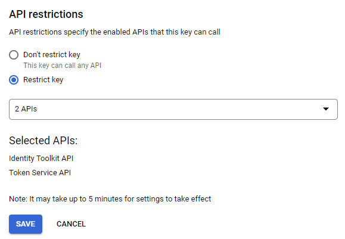

`
 Copyright 2020 Google LLC. This software is provided as-is, without warranty
 or representation for any use or purpose. Your use of it is subject to your
 agreement with Google.
`

# Pôle Emploi / PSO repository
## translation-app-assessment
This contains example code for the Jan-Feb 2021 engagement on a code review / assessment of Pôle Emploi's voice+translation application.
## How to build the gcp infrastructure 
[Build Infrastructure - Terraform GCP](translation-app-assessment/terraform/README.md)
## Create the firebase application

Log in to the Firebase console, then click Add project.

Select your existing Google Cloud project from the dropdown menu, then click Continue.

Click Add Firebase.

Enable authentication for your Firebase project to use Firestore:

In the Firebase console, click Authentication from the navigation panel.

Go to the Sign-in Method tab.

Enable Email/Password and the anonymous authentication, for example:

Add Firebase to your app by following the web guide.

### Add Cloud Firestore Security Rules

To set up and deploy the firestore security rules, open the Rules tab in the Cloud Firestore section of the Firebase console.
Copy the rules from [rules.txt](./firestore_rules/rules.txt) Write your rules in the online editor, then click Publish

### Edit the API key to add restrictions

In APIs and Service, the Credentials part, we could restrict the API key to specific websites and Api's (only the Identity Toolkit API and
Token Service API)

**First step**:

**Second step**:

